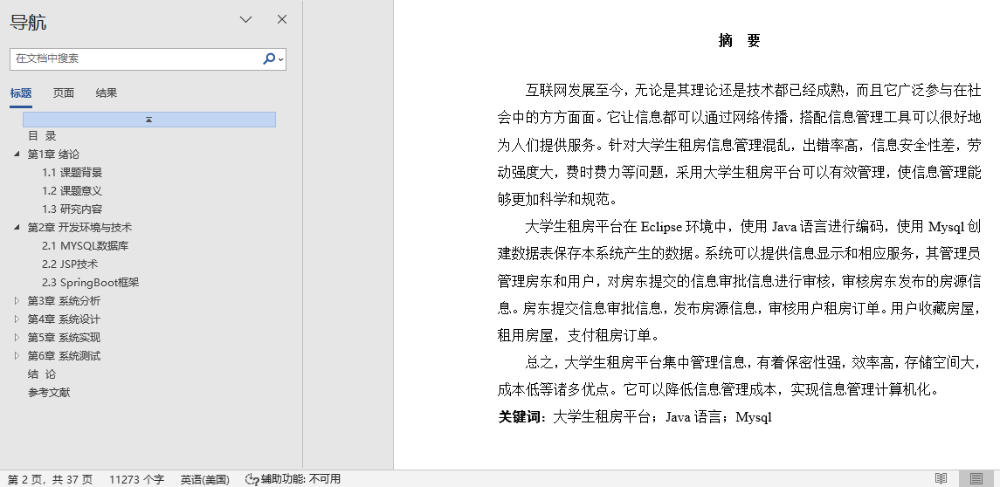
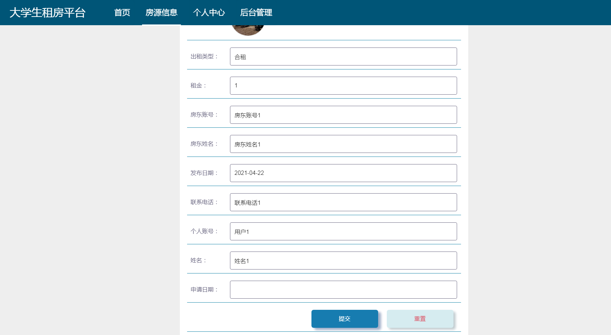
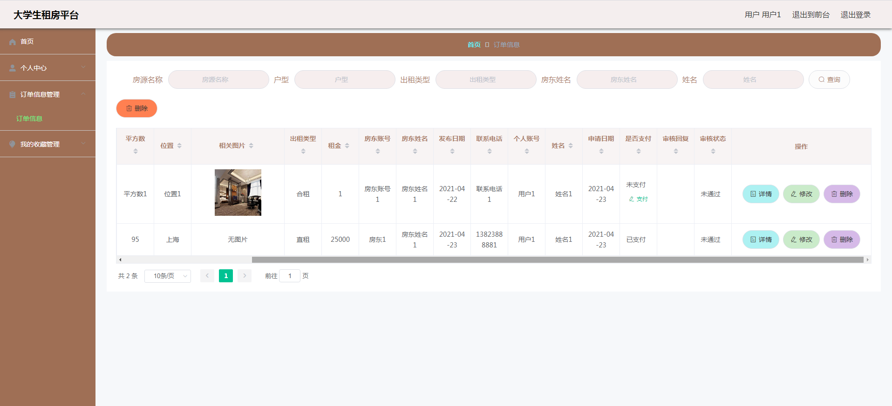
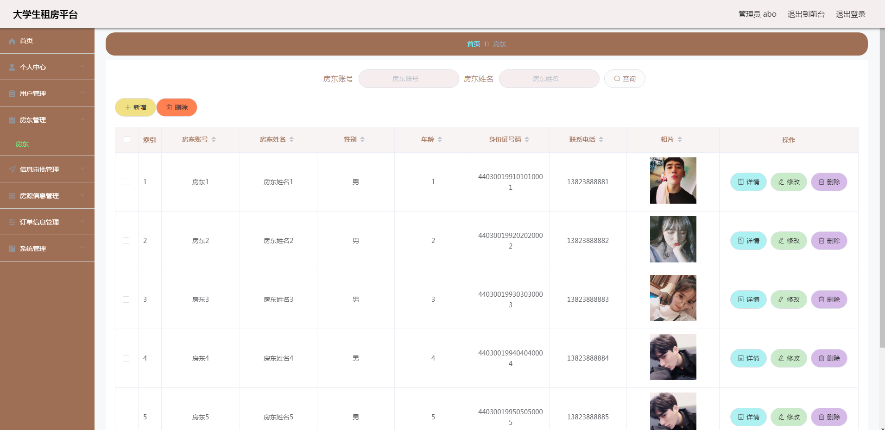
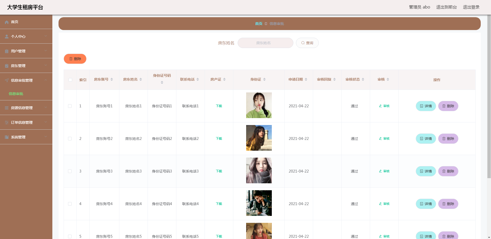
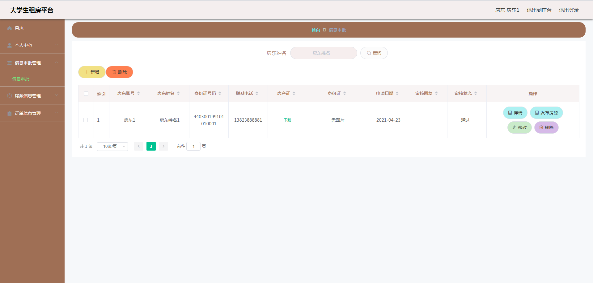
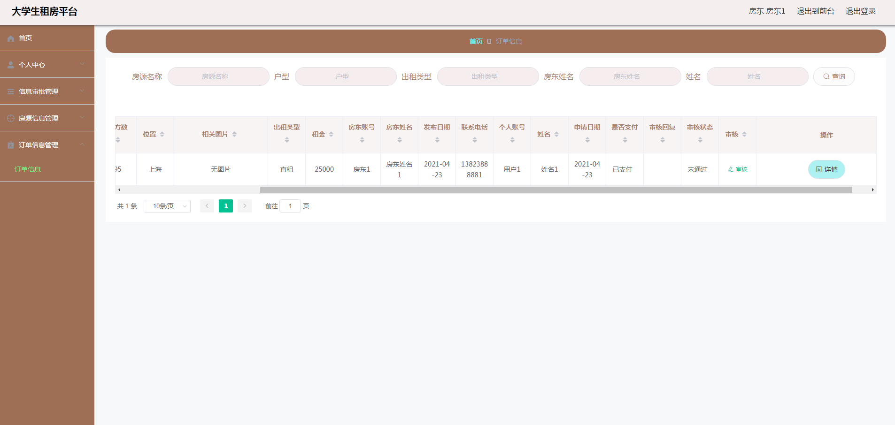

## 基于SpringBoot的大学生租房平台(程序+报告)

###  获取sql数据库文件: 从戎源码网 (https://armycodes.com/) QQ: 386869957 QQ群: 377586148
###  所有系统地址: (https://github.com/YuLin-Coder/AllProjectCatalog) 
###  所有项目以及源代码本人均调试运行无问题 可支持远程安装部署调试、定制修改、代码讲解

## 项目介绍
基于SpringBoot的大学生租房平台，系统包含两种角色：用户、管理员，系统分为前台和后台两大模块，主要功能如下：

### 【管理员】:
房东管理: 管理员管理房东的资料，包括修改、新增、删除等操作。
信息审批管理: 管理员审批房东上传的房产证和身份证信息，审批通过后房东才能发布房源信息。
房源信息管理: 管理员审核房东发布的房源信息，审核通过后房源信息才能展示在前台进行出租。

### 【用户】:
房源信息: 用户查看所有要出租的房源信息，可以根据房源名称、户型、出租类型等字段查询。
房源详细信息: 用户查看房源的详细介绍，可以收藏房源或点击租房按钮进行租房。
提交租房信息: 用户提交租房申请，设置申请日期。
订单信息管理: 用户查看并支付租房订单，确认订单是否通过房东审核。

### 【房东】:
信息审批管理: 房东查看信息审批状态，通过审核后才能发布房源信息。
房源信息管理: 房东管理发布的房源信息，发布前需要管理员审核。
订单信息管理: 房东查看并审核用户的租房订单，确认用户是否支付。

## 项目技术
- 编程语言：Java
- 数据库：MySQL
- 项目管理工具：Maven
- 前端技术：HTML、CSS、JavaScript、Jquery、Vue
- 后端技术：Spring、SpringMVC、MyBatis

## 运行环境
- JDK版本：JDK1.8及以上
- 开发工具：IDEA、Ecplise、Myecplise都可以
- 数据库: MySQL5.7及以上
- Maven：maven3.0及以上
- Node：14.14.0及以上

## 运行截图

